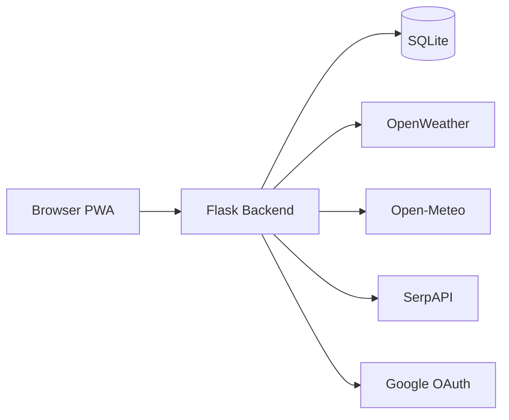

# Weather Intelligence Web App

A full-stack weather dashboard built with **Flask**, **SQLite**, and **JavaScript**. Search any city, view live forecasts on interactive maps with animated radar layers, get AI-style weather summaries, travel and farming advice, weather alerts, and save favorites—all in an installable **Progressive Web App (PWA)**.


## Live demo

Run locally: `python server.py` → [http://127.0.0.1:5000/](http://127.0.0.1:5000/)

## Features

| Category | Highlights |
|---|---|
| **Weather** | Current conditions, 24h hourly & 7-day forecasts, air quality, UV index |
| **Maps & radar** | Leaflet map, place search, rain/cloud/wind/temperature radar animation |
| **Intelligence** | AI summary, travel guide, farming guide, 6-type weather alert cards |
| **Accounts** | Signup, login, Google OAuth, profile, password reset |
| **Personalization** | Favorite cities, search history, weather history, theme & units settings |
| **PWA** | Install to home screen, offline mode, service worker caching |
| **Quality** | Lazy loading, accessibility, SEO, security headers |

## Quick start

```powershell
git clone <your-repository-url>
cd "weather app"
python -m venv .venv
.\.venv\Scripts\Activate.ps1
python -m pip install -r requirements.txt
copy .env.example .env
# Edit .env with your API keys, then:
python server.py
```

Open **http://127.0.0.1:5000/** in your browser.

Full setup instructions: **[Installation Guide](docs/INSTALLATION.md)**

## Screenshots

| Dashboard | Radar map |
|---|---|
| Weather cards, forecasts, alerts | Animated radar layers on Leaflet |

> Add screenshots to a `docs/screenshots/` folder before submission if required by your institution.

## Tech stack

| Layer | Technology |
|---|---|
| Backend | Python, Flask, SQLite |
| Frontend | HTML5, CSS3, Vanilla JavaScript |
| Maps | Leaflet, OpenWeather map tiles |
| Charts | Chart.js (lazy loaded) |
| APIs | OpenWeather, Open-Meteo, SerpAPI, Google OAuth |
| PWA | Service Worker, Web App Manifest |

## Project structure

```text
weather app/
├── server.py              # Flask app entry point
├── auth.py                # Authentication routes
├── database.py            # SQLite schema
├── user_api.py            # User data REST APIs
├── templates/             # HTML templates
├── static/                # CSS, JS, PWA assets
├── docs/                  # Documentation (submission package)
└── data/                  # SQLite DB (auto-created, gitignored)
```

Detailed breakdown: **[Folder Structure](docs/FOLDER_STRUCTURE.md)**

## Documentation

| Document | Description |
|---|---|
| [Installation Guide](docs/INSTALLATION.md) | Prerequisites, setup, environment variables, troubleshooting |
| [Project Report](docs/PROJECT_REPORT.md) | Objectives, features, design decisions, testing, conclusion |
| [API Documentation](docs/API.md) | Complete REST API reference with request/response examples |
| [Architecture & Diagrams](docs/ARCHITECTURE.md) | System architecture, ER diagram, flowcharts (Mermaid) |
| [Folder Structure](docs/FOLDER_STRUCTURE.md) | File and directory reference |

## Architecture overview



Full diagrams (ER, auth flow, weather flow, PWA offline): **[Architecture](docs/ARCHITECTURE.md)**

## API overview

| Group | Endpoints |
|---|---|
| Auth | `/api/auth/signup`, `login`, `logout`, `profile`, `forgot-password`, Google OAuth |
| User data | `/api/favorites`, `/api/search-history`, `/api/weather-history`, `/api/settings` |
| Weather | `/api/weather`, `/api/hourly-forecast`, `/api/daily-forecast`, `/api/maps-search` |
| Radar | `/api/radar-frames`, `/api/weather-tile/<layer>/<z>/<x>/<y>.png` |

Full reference: **[API Documentation](docs/API.md)**

## Environment variables

Copy `.env.example` to `.env` and configure:

```env
SECRET_KEY=your-secret
OPENWEATHER_API_KEY=your-key
SERPAPI_KEY=your-key
APP_BASE_URL=http://127.0.0.1:5000
GOOGLE_CLIENT_ID=optional
GOOGLE_CLIENT_SECRET=optional
```

## Authentication

- Email/password accounts with secure password hashing
- Optional **Google Sign-In** (OAuth 2.0)
- Password reset via token (`/reset-password`)
- Profile page at `/profile`
- Session cookies: HttpOnly, SameSite=Lax

## Database

SQLite at `data/weather.db` with tables for users, favorite cities, search history, weather history, and user settings. Schema auto-initializes on first run.

## PWA

- Install via browser **Install app** button
- Service worker caches app shell and weather API responses
- Offline banner when network is unavailable

## Development

```powershell
# Run server
python server.py

# Optional CLI weather check
python weather.py
```

## Security

- API keys never exposed to the browser
- Security headers: `X-Content-Type-Options`, `X-Frame-Options`, `Referrer-Policy`, `Permissions-Policy`
- Private `Cache-Control` on authenticated API routes
- Set `SESSION_COOKIE_SECURE=1` and `ENABLE_HSTS=1` in production

## Contributing

1. Fork the repository
2. Create a feature branch
3. Commit changes
4. Open a pull request

## License

This project is provided for educational and portfolio use. Add your preferred license before public release.

## Author

**Your Name** — replace with your details for submission.

## Acknowledgments

- [OpenWeather](https://openweathermap.org/) — weather and radar tile data
- [Open-Meteo](https://open-meteo.com/) — forecast data
- [Leaflet](https://leafletjs.com/) — interactive maps
- [SerpAPI](https://serpapi.com/) — place search
