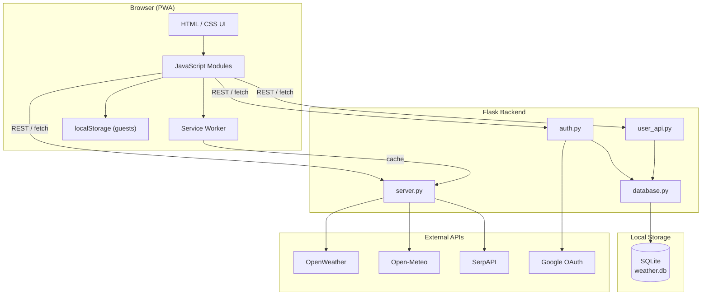
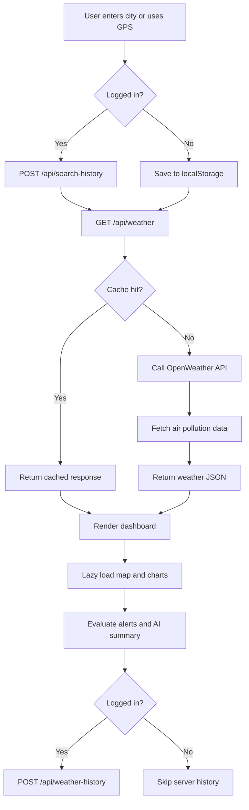
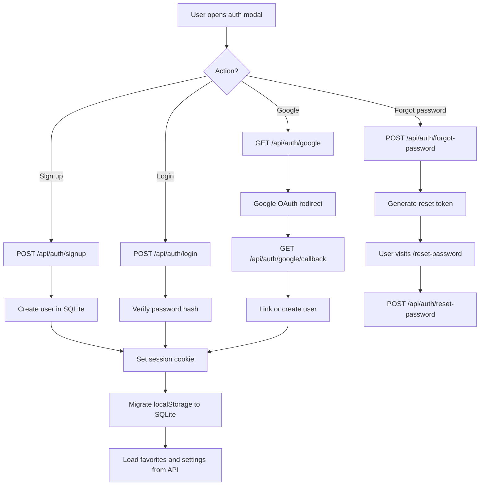
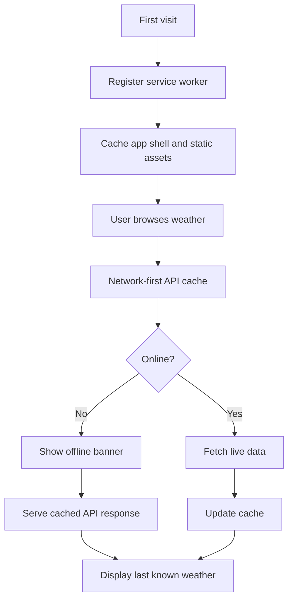
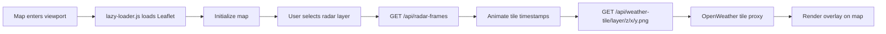
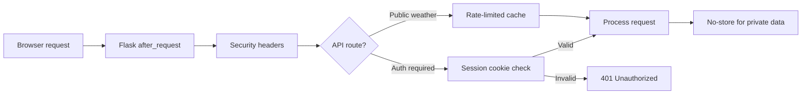

# Architecture, ER Diagram, and Flowcharts

This document describes the system architecture, database design, and key application flows.

---

## System architecture



### Layer summary

| Layer | Technology | Responsibility |
|---|---|---|
| Presentation | HTML, CSS, JavaScript | Weather UI, maps, radar, auth modal, PWA |
| Application | Flask blueprints | Routing, session auth, API proxy, caching |
| Data | SQLite | Users, favorites, history, settings |
| External | OpenWeather, Open-Meteo, SerpAPI, Google | Weather, forecasts, maps search, OAuth |

---

## Entity-relationship diagram

```mermaid
erDiagram
    USERS ||--o{ FAVORITE_CITIES : has
    USERS ||--o{ SEARCH_HISTORY : has
    USERS ||--o{ WEATHER_HISTORY : has
    USERS ||--|| USER_SETTINGS : has

    USERS {
        int id PK
        string email UK
        string name
        string password_hash
        string google_id UK
        string avatar_url
        string default_city
        string reset_token
        float reset_token_expires
        string created_at
    }

    FAVORITE_CITIES {
        int id PK
        int user_id FK
        string city
        string created_at
    }

    SEARCH_HISTORY {
        int id PK
        int user_id FK
        string city
        string searched_at
    }

    WEATHER_HISTORY {
        int id PK
        int user_id FK
        string city
        string location_name
        string country
        float temperature
        string description
        string icon
        float lat
        float lng
        text payload
        string recorded_at
    }

    USER_SETTINGS {
        int user_id PK_FK
        string theme
        string units
        string default_city
        int notifications_enabled
        string updated_at
    }
```

### Relationships

- One **user** has many **favorite cities**, **search history** entries, and **weather history** entries.
- One **user** has exactly one **settings** row (1:1).
- All child tables use `ON DELETE CASCADE` when a user is removed.

---

## Weather search flow



---

## Authentication flow



---

## PWA offline flow



---

## Radar and map flow



---

## Security architecture



Key measures:

- API keys stored server-side only
- HttpOnly, SameSite session cookies
- Security headers on all responses
- Private cache control for authenticated APIs
